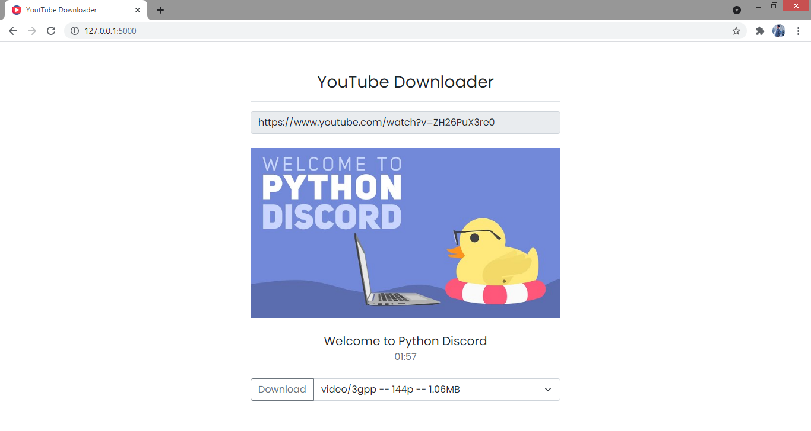

# YouTube-Downloader

Youtube Downloader WebApp Using Python and [Flask](https://flask.palletsprojects.com/en/2.0.x/)

## Preview App



## Usage

1. Clone or pull this repository
2. Run this command

```bash
$ pip install -r requirements.txt
```

## Run Flask App

```bash
$ cd <path:repository> python run.py
```

## License

Distributed under the MIT License. See `LICENSE` for more information.

## Contact

Mochammad Arya Salsabila - Aryasalsabila789@gmail.com
